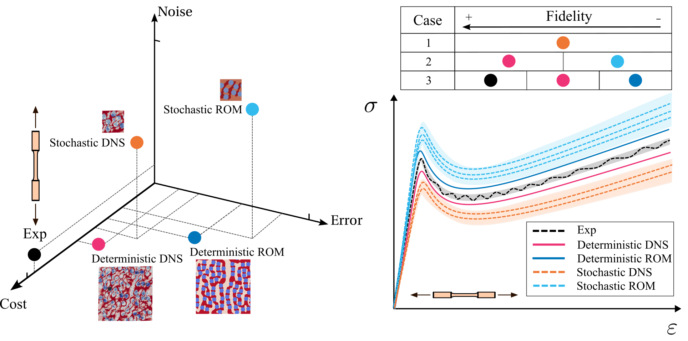

<p align="center">
  <a href=""></a>
</p>


# MF-VeBRNN

| [**GitHub**](https://github.com/bessagroup/MF-VeBRNN.git)
| [**Paper**](https://www.sciencedirect.com/science/article/pii/S0045782525007510) |
[**Documentation**](https://bessagroup.github.io/MF-VeBRNN/)|


## Summary
`MF-VeBRNN` provides the implementation for the paper [Single-to-multi-fidelity history-dependent learning with uncertainty quantification and disentanglement: Application to data-driven constitutive modeling](https://www.sciencedirect.com/science/article/pii/S0045782525007510).


## Statement of need

In the domain of data-driven modeling, there are different fidelities of data with different cost, accuracy, and noise. Data-driven learning is generalized to consider history-dependent multi-fidelity data, while quantifying epistemic uncertainty and disentangling it from data noise (aleatoric uncertainty). This generalization is hierarchical and adapts to different learning scenarios: from training the simplest single-fidelity deterministic neural networks up to the proposed multi-fidelity variance estimation Bayesian recurrent neural networks.

<div align="center">
    
</div>

**Authorship**:
- This repo is developed [Jiaxiang Yi](https://scholar.google.com/citations?user=LM6O83QAAAAJ&hl=en), a PhD researcher of Delft University of Technology, based on his research context.


## Getting started

**Installation**

(1). git clone the repo to your local machine

```
https://github.com/bessagroup/MF-VeBRNN.git
```

(2). go to the local folder where you cloned the repo, and pip install it with editable mode

```
pip install --editable .
```


(3). install requirements
```
pip install -r requirements.txt
```
---

If you use [MF-VeBRNN](https://github.com/bessagroup/MF-VeBRNN), please cite the following [paper](https://www.sciencedirect.com/science/article/pii/S0045782525007510):

```
@article{yi2026single_to_multi,
title = {Single-to-multi-fidelity history-dependent learning with uncertainty quantification and disentanglement: Application to data-driven constitutive modeling},
journal = {Computer Methods in Applied Mechanics and Engineering},
volume = {448},
pages = {118479},
year = {2026},
issn = {0045-7825},
}
```
## Community Support

If you find any **issues, bugs or problems** with this package, please use the [GitHub issue tracker](https://github.com/bessagroup/MF-VeBRNN/issues) to report them.

## License

Copyright (c) 2025, Jiaxiang Yi

All rights reserved.

This project is licensed under the BSD 3-Clause License. See [LICENSE](https://github.com/bessagroup/MF-VeBRNN/blob/main/LICENSE) for the full license text.

